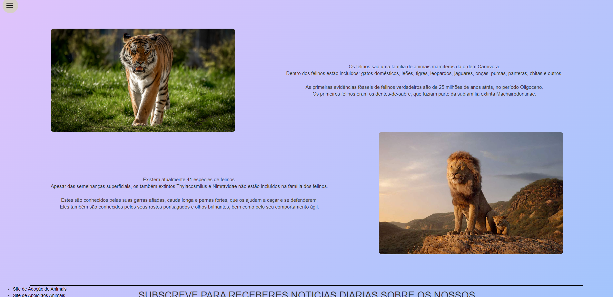
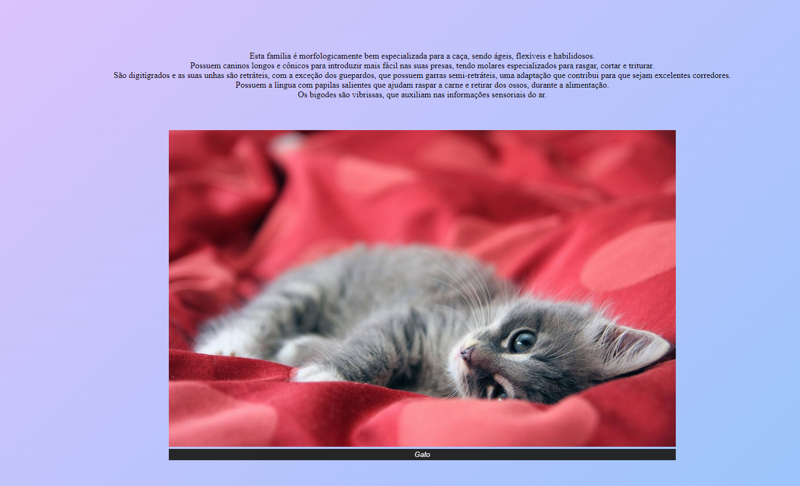
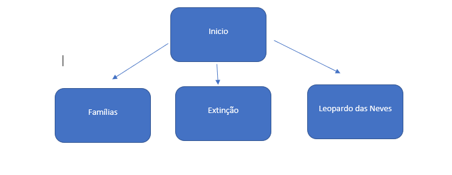

# C2 : Interface de Utilizador
Começamos com a primeira página que fala um pouco sobre os felinos, tambem temos 2 imagens na  pagina e por fim temos 2 links para sites de adoção de felinos e um formulário para caso a pessoa queira receber noticias diariamente sobre os felinos.
Na segunda página falamos sobre as suas caracteristicas, mostramos mais imagens de felinos e por ultimo temos uma tabela a indicar as familias e subfamilias dos felinos.
Na terceira pagina falamos sobre 3 felinos que foram extintos e o porque de terem sido extintos.
Na quarta e ultima pagina vamos falar sobre um felino que o grupo achou interessante e neste caso é o Leopardo das Neves.

### Sketchs

 
Nesta primeira pagina podemos ver alguma informaçãoa acerca dos felinos.

Nesta pagina podemos ler sobre as suas caracteristicas e saber mais sobre as suas familias e subfamilias.

### Sitemap

  
Aqui temos um sitemap para ajudar a perceber o website.

  

[< Anterior](c1.md) | [Proximo >](c3.md)